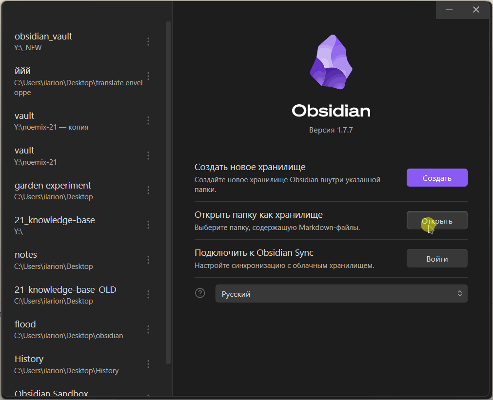

## Перед сборкой web
Перед сборкой необходимо отрыть базу знаний через Obsidian и выгрузить все заметки через плагин [Enveloppe](https://enveloppe.ovh/).

Для этого: 
1. В Obsidian откройте хранилище `obsidian_vault`;
2. `Ctrl+P` → `Enveloppe: загрузить все общие заметки.`; \
P.S. Страницы собираются не мгновенно, Obsidian уведомит когда процесс окончится.

> **Info**\
> \> Необходимо конвертировать `.md` в статичные, т.к. `Quartz` не обрабатывает `Dataview` запросы, которые обильно используются в noemix 21. 

## Сборка
Для сборки статического сайта используется [Quartz](https://quartz.jzhao.xyz/).

> \> Для сборки необходим `Docker`, либо `npm`.

**После завершения этапа** [Перед сборкой web](#Перед%20сборкой%20web) выполните в терминале `make build`. Эта команда запускает скрипты для вставки таблиц из метаданных, сборку через Quartz с использованием `Docker`.\
В случае успеха собранные страницы сайта будут находиться в директории `website`.

## Запуск
Проверить работоспособность можно через `makefile nginx`.
