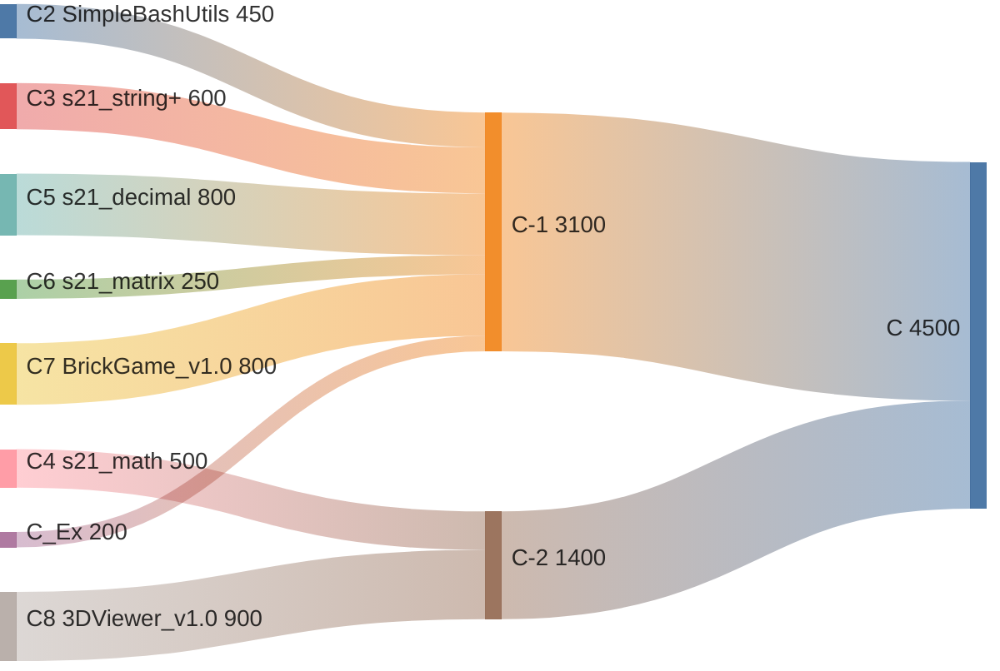
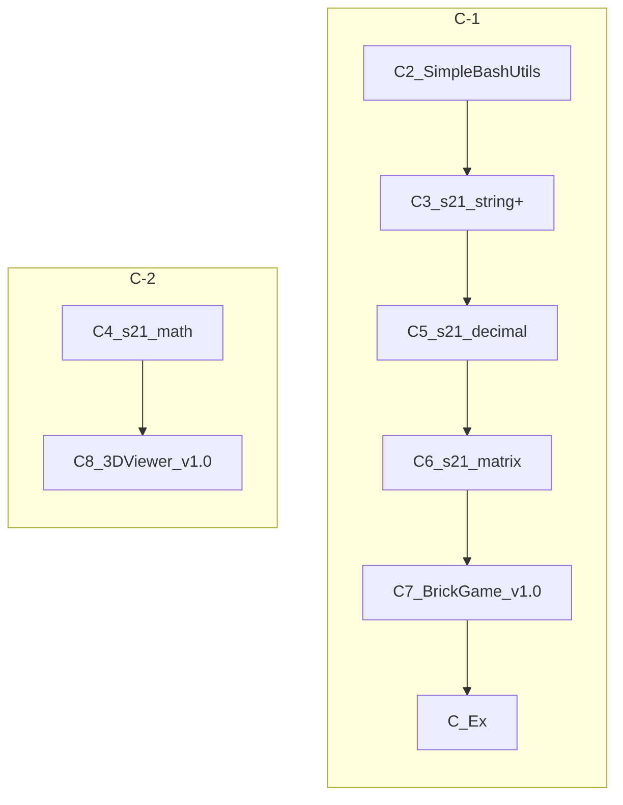

> Программирование на C подобно быстрому танцу на полу, только что натёртом воском, среди людей с острыми бритвами в руках.

\- Waldi Ravens

___

> [!note]- Заметки по всем C проектам
> ```dataview
> TABLE WITHOUT ID
> 	file.link AS "Название",
> 	project AS "Проект",
> 	date AS "Опубликовано"
> FROM "data/03. 🌱Ваши заметки" OR "data/04. 🪴Ваши статьи"
> WHERE branch = [[C]] AND project
> SORT date DESC, project ASC
> ``` 

> [!note] Прочие заметки по C
> ```dataview
> TABLE WITHOUT ID
> 	file.link AS "Название",
> 	date AS "Опубликовано"
> FROM "data/03. 🌱Ваши заметки" OR "data/04. 🪴Ваши статьи"
> WHERE branch = [[C]] AND !project
> SORT date DESC, file.link ASC
> ``` 


## Проекты
```dataviewjs
const group = "C - 1";
const projects = dv.pages('"data/99. 🗃️Картотека/Все проекты/C"')
    .filter(page => 
        page.tags?.includes('project') && 
        !page.tags?.includes('index') && 
        page.group === group
    )
    .sort(note => note.file.name, 'asc'); // Сортировка по имени файла в порядке возрастания

if (projects.length === 0) {
    dv.paragraph(`### ${group}\nНет доступных проектов.`);
} else {
    const output = projects.map((note, index) => {
        const fileLink = note.file.link;
        const xp = note.xp ? `${note.xp}xp` : "";
        const xpBonus = note["xp-with-bonus"] ? `- ${note["xp-with-bonus"]}xp` : "";
		const socialLink = note["social-link"] ? ` · [Чат](${note["social-link"]})` : "";
        const description = note.description ? `\n— _${note.description}_` : "";

        // Определяем тип проекта из поля project-type
        let type = "Тип не указан";
        switch (note["project-type"]) {
            case "team":
                type = "Групповой";
                break;
            case "individual":
                type = "Индивидуальный";
                break;
            case "intensive":
                type = "Интенсив";
                break;
            case "exam":
                type = "Экзамен";
                break;
            case "exam-module":
				type = "Группа экзаменов";
			break;
        }
        return `${index + 1}. #### ${fileLink}\n**${type}** · **${xp} ${xpBonus}**  ${socialLink}${description}`.trim();
    }).join("\n");

    dv.paragraph(`### ${group}`);
    dv.paragraph(output);
}
```

```dataviewjs
const group = "C - 2";
const projects = dv.pages('"data/99. 🗃️Картотека/Все проекты/C"').filter(page => 
    page.tags?.includes('project') && 
    !page.tags?.includes('index') && 
    page.group === group
);

if (projects.length === 0) {
    dv.paragraph(`### ${group}\nНет доступных проектов.`);
} else {
    const output = projects.map((note, index) => {
        const fileLink = note.file.link;
        const xp = note.xp ? `${note.xp}xp` : "";
        const xpBonus = note["xp-with-bonus"] ? `- ${note["xp-with-bonus"]}xp` : "";
		const socialLink = note["social-link"] ? ` · [Чат](${note["social-link"]})` : "";
        const description = note.description ? `\n— _${note.description}_` : "";

        // Определяем тип проекта из поля project-type
        let type = "Тип не указан";
        switch (note["project-type"]) {
            case "team":
                type = "Групповой";
                break;
            case "individual":
                type = "Индивидуальный";
                break;
            case "intensive":
                type = "Интенсив";
                break;
            case "exam":
                type = "Экзамен";
                break;
            case "exam-module":
				type = "Группа экзаменов";
			break;
        }
        return `${index + 1}. #### ${fileLink}\n**${type}** · **${xp} ${xpBonus}**  ${socialLink}${description}`.trim();
    }).join("\n");

    dv.paragraph(`### ${group}`);
    dv.paragraph(output);
}
```

```dataviewjs
// проекты без тега group считаются устаревшими
const projects = dv.pages('"data/99. 🗃️Картотека/Все проекты/C"').filter(page => 
    page.tags?.includes('project') && 
    !page.tags?.includes('index') && 
    page.deprecated === true
);

if (projects.length > 0) {
    const output = projects.map((note, index) => {
        const fileLink = note.file.link; // Ссылка на файл
        const xp = note.xp ? `${note.xp}xp` : ""; // Опыт
        const xpBonus = note["xp-with-bonus"] ? `(${note["xp-with-bonus"]})` : "";
        const socialLink = note["social-link"] ? ` · [Чат](${note["social-link"]})` : "";
        const description = note.description ? `\n— _${note.description}_` : "";

        // Определяем тип проекта
        let type = "Тип не указан";
        switch (note["project-type"]) {
            case "team":
                type = "Групповой";
                break;
            case "individual":
                type = "Индивидуальный";
                break;
            case "intensive":
                type = "Интенсив";
                break;
            case "exam":
                type = "Экзамен";
                break;
            case "exam-module":
                type = "Группа экзаменов";
                break;
        }

        return `${index + 1}. #### ${fileLink}\n**${type}** · **${xp} ${xpBonus}**  ${socialLink}${description}`.trim();
    }).join("\n");

    // Заголовок и информационный блок
    const heading = "### Устаревшие проекты";
    const info = `> [!info]\n> Устаревшие проекты больше не доступны для выполнения.`;

    // Вывод результатов
    dv.paragraph(heading);
    dv.paragraph(output);
    dv.paragraph(info);
}
```


---

## Визуализация
### Xp проектов
[[C 2025-01-11 21.35.24.excalidraw]]
![[C 2025-01-11 21.35.24.excalidraw.svg]]

### Блок-схема ветки
[[C 2025-01-11 21.35.43.excalidraw]]
![[C 2025-01-11 21.35.43.excalidraw.svg]]

%% excalidraw source 

%%

%% excalidraw source

%%
