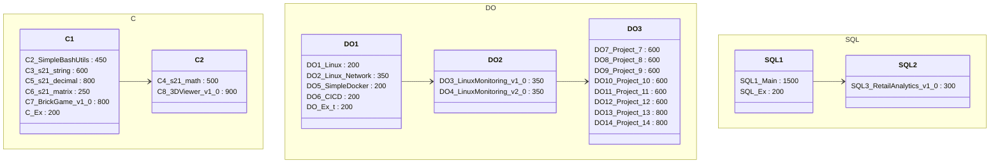

В приложении Obsidian может отображаться в странном виде, а может и нормально.





---


---


```mehrmaid
flowchart TD

    subgraph C
        direction TB
        subgraph C1
            direction LR
            C2_SimpleBashUtils --> C3_s21_string
            C3_s21_string --> C5_s21_decimal
            C5_s21_decimal --> C6_s21_matrix
            C6_s21_matrix --> C7_BrickGame_v1.0
            C7_BrickGame_v1.0 --> C_Ex
        end

        subgraph C2
            direction TB
            C_Ex --> C4_s21_math
            C4_s21_math --> C8_3DViewer_v1.0
        end
    end
C2_SimpleBashUtils["[[C2 SimpleBashUtils]]"]
    subgraph DevOPS
        direction TB
        subgraph DO-1
            direction TB
            C6_s21_matrix --> DO1_Linux
            DO1_Linux --> DO2_Linux_Network
            DO2_Linux_Network --> DO5_SimpleDocker
            DO5_SimpleDocker --> DO6_CICD
            DO6_CICD --> DO_Ex-t
        end

        subgraph DO-2
            direction TB
            DO3_LinuxMonitoring_v1.0 --> DO4_LinuxMonitoring_v2.0
        end

        subgraph DO-3
            direction TB
            DO7_DevOps_Project_7 --> DO7_DevOps_Project_8
            DO7_DevOps_Project_8 --> DO7_DevOps_Project_9
            DO7_DevOps_Project_9 --> DO7_DevOps_Project_10
            DO7_DevOps_Project_10 --> DO7_DevOps_Project_11
            DO7_DevOps_Project_11 --> DO7_DevOps_Project_12
            DO7_DevOps_Project_12 --> DO7_DevOps_Project_13
            DO7_DevOps_Project_13 --> DO7_DevOps_Project_14
        end

    end


    subgraph SQL
        direction TB
        subgraph SQL-1
            direction TB
            C6_s21_matrix --> SQL1
            SQL1 --> SQL_Ex
        end

        subgraph SQL-2
            direction TB
            SQL2_Info21_v1.0 --> SQL3_RetailAnalytics_v1.0
        end
    end
```


```mehrmaid
flowchart TD

    subgraph C
        direction TB
        subgraph C1
            direction LR
            C2_SimpleBashUtils --> C3_s21_string
            C3_s21_string --> C5_s21_decimal
            C5_s21_decimal --> C6_s21_matrix
            C6_s21_matrix --> C7_BrickGame_v1.0
            C7_BrickGame_v1.0 --> C_Ex
        end

        subgraph C2
            direction TB
            C_Ex --> C4_s21_math
            C4_s21_math --> C8_3DViewer_v1.0
        end
    end
C2_SimpleBashUtils["[[C2 SimpleBashUtils]]"]
C3_s21_string["[[C3 s21_string+]]"]
```


```mehrmaid
flowchart TD

    subgraph C
        direction TB
        subgraph C1
            direction LR
            C2_SimpleBashUtils["[[C2 SimpleBashUtils]]"] --> C3_s21_string
            C3_s21_string --> C5_s21_decimal
            C5_s21_decimal --> C6_s21_matrix
            C6_s21_matrix --> C7_BrickGame_v1.0
            C7_BrickGame_v1.0 --> C_Ex
        end

        subgraph C2
            direction TB
            C_Ex --> C4_s21_math
            C4_s21_math --> C8_3DViewer_v1.0
        end
    end

```


---


```mehrmaid
flowchart TD

    subgraph C
        direction TB
        subgraph C1
            direction LR
            C2_SimpleBashUtils["[[C2 SimpleBashUtils]]"] --> C3_s21_string
            C3_s21_string --> C5_s21_decimal
            C5_s21_decimal --> C6_s21_matrix
            C6_s21_matrix --> C7_BrickGame_v1.0
            C7_BrickGame_v1.0 --> C_Ex
        end

        subgraph C2
            direction TB
            C_Ex --> C4_s21_math
            C4_s21_math --> C8_3DViewer_v1.0
        end
    end

```


```mehrmaid
flowchart LR
A --> B & C --> D --> E --> F & G
G --> F
C("[[thisisalink]]")

F("#uni")
```


